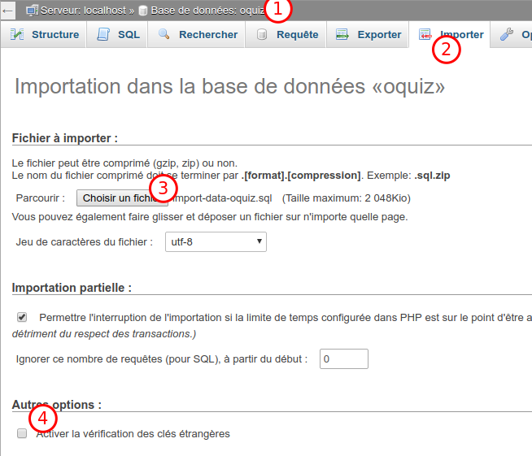

# Guide import des données

La structure des données vient avec des contraintes de clés étrangères **afin de garantir l'intégrité des données**.

Cela veut dire qu'on ne peut associer un enregistrement qu'avec un enregistrement existant dans la base. Par exemple un quiz particulier ne peut être lié qu'à un auteur existant (l'id de l'auteur doit exister dans la base). Sinon vous aurez une erreur du type `Integrity constraint violation`.

Comme les données exportées ne sont pas "dans l'ordre" l'import risque de planter (erreur ci-dessus) **vous devez donc _décocher_ une option en particulier** : _Activer la vérification des clés étrangères_)

Dans le doute suivez ces 4 étapes pour importer les données : 

_Après avoir déjà importé_ le fichier "import-oquiz.sql".

1. Sélectionnez votre base.
2. Onglet "Importer".
3. Choisissez le fichier "import-data-oquiz.sql"
4. **Décochez l'option** : _Activer la vérification des clés étrangères_
5. Bouton _Exécuter_

En cas d'erreur refaites toutes les étapes.

